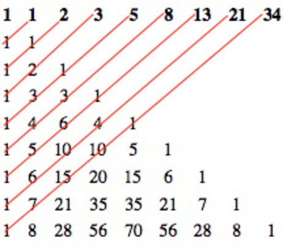

# 1) Decimal To Binary
```javascript
const decToBin = function(num = 0) {
  if(~~num !== num) throw new Error('Must Be Integer!');
  let res = '';
  let sign = 1;
  if(num < 0) {
    sign = -1;
    num = Math.abs(num);
  }

  while(num > 0) {
    res = (num % 2) + res;
    num = Math.floor(num / 2);
  }
  
  return res * sign;
};

console.log(decToBin(123) == 123..toString(2));
console.log(decToBin(145871865) == 145871865..toString(2));
console.log(decToBin(1456165378) == 1456165378..toString(2));
console.log(decToBin(15313523) == 15313523..toString(2));
```

# 2) Binary To Decimal
```javascript
const binToDec = function(num) {
  return (num + '').split('').reverse()
    .reduce((t, v, i) => (v === '1') ? t + Math.pow(2, i) : t, 0);
}

console.log(binToDec(1010101010) === parseInt('1010101010', 2));
console.log(binToDec('101100111') === parseInt('101100111', 2));
console.log(binToDec(1101) === parseInt('1101', 2));
console.log(binToDec('1111111111111') === parseInt('1111111111111', 2));
```

# 3) Palindrome
## Default
```javascript
function isPalindrome(str) {
  const len = str.length;
  const limit = Math.floor(len / 2);
  for(let i = 0; i < limit; i++) {
    if (str[i] !== str[len - 1 - i]) return false;
  }
  return true;
}

isPalindrome('madam'); // true
isPalindrome('toyota'); // false
```
## Built In Methods
```javascript
const palindrome = function(str) {
  str = str.toLowerCase().replace(/[^a-z0-9]/g, '');
  return str.split('').reverse().join('') === str;
 }

 console.log(palindrome("never odd or even...")); // true
 console.log(palindrome("My age is 0, 0 si ega ym.")); // true
 console.log(palindrome("1 eye for of 1 eye.")); // false
 console.log(palindrome("0_0 (: /-\\ :) 0–0")); // true
```

# 4) Currying
```javascript
function curry(fn) {
  const arity = fn.length;
  return (function resolver(...args) {
    const memory = args;
    return function(arg) {
      const local = memory.slice();
      local.push(arg);
      const next = local.length >= arity ? fn : resolver;
      return next(...local);
    };
  }());
}

const fun = function(a,b,c){
  console.log(a,b,c);
};

console.log(curry(fun)(3)(true, 'hidden')('a')); // 3 true a
```

# 5) Partial Application
```javascript
const partialAny = (function() {
  const partialAnyInn = function(fn, ...args1) {
    return function(...args2) {
      const args = [];
      args1.forEach(v => {
        args.push(v === partialAny._ ? args2.shift() : v);
      });
      return fn(...args, ...args2);
    };
  }

  partialAnyInn._ = {};
  return partialAnyInn;
}());

const __ = partialAny._;
function hex(r, g, b) {
  return `#${r}${g}${b}`;
}

const greenMax = partialAny(hex, __, 'ff');
console.log(greenMax('33', '44'));  // "#33ff44"
```

# 6) Function Composition
## 1st
```javascript
const compose = (...fns) => x => fns.reduceRight((v, f) => f(v), x);
```
## 2nd
```javascript
const compose = (...fns) => fns.reduce((f, g) => (...args) => f(g(...args)))
```
## 3rd
```javascript
const compose = (fn, ...rest) =>
  (...args) =>
    (rest.length === 0)
      ? fn(...args)
      : fn(compose(...rest)(...args));
```
## Pipe
### 1st
```javascript
const pipe = (...fns) => x => fns.reduce((v, f) => f(v), x);
```
### 2nd
```javascript
const pipe = (fn, ...fns) => (...args) => fns.reduce( (acc, fn) => fn(acc), fn(...args));
```

# 7) Array.prototype.map Polyfill
## With Recursion
```javascript
const mapWith = (fn, [first, ...rest]) =>
  first === undefined
  ? []
  : [fn(first), ...mapWith(fn, rest)];

mapWith((x) => x * x, [1, 2, 3, 4, 5]) // => [1,4,9,16,25]
```
## With Reduce
```javascript
if (!Array.prototype.mapUsingReduce) {
  Array.prototype.mapUsingReduce = function(callback) {
    return this.reduce(function(mappedArray, currentValue, index, array) {
      mappedArray[index] = callback(currentValue, index, array);
      return mappedArray;
    }, []);
  };
}

[1, 2, , 3].mapUsingReduce(
  (currentValue, index, array) => currentValue + index + array.length
); // [5, 7, , 10]
```

# 8) Memoization
## Default
```javascript
// we can memoize only pure functions

function memoize(func) {
  const cache = {};
  return function() {
    const key = JSON.stringify(arguments);
    if(cache[key]) {
      return cache[key];
    }
    else {
      const val = func.apply(this, arguments);
      cache[key] = val;
      return val;
    }
  };
}
```
## Upgraded
```javascript
const memoize = function(fun) {
  fun.memory = {};
  return function(...args) {
    const key = JSON.stringify(args);
    return fun.memory[key] ? fun.memory[key] : fun.memory[key] = fun(...args);
  }
};
```
## Doubly Upgraded
This version doesn't call a pure function all over even if it was called with something and
returned undefined
```javascript
function cache(func) {
  func.cache = {};
  return function(...args) {
    const key = JSON.stringify(args);
    if(key in func.cache) {
      return func.cache[key];
    } else return func.cache[key] = func(...args);
  };
}
```
## As a Method
```javascript
function memoize(func, depsFunc) {
  const cache = {};
  return function() {
    const key = JSON.stringify([depsFunc(), arguments]);
    if(cache[key]) {
      return cache[key];
    }
    else {
      const val = func.apply(this, arguments);
      cache[key] = val;
      return val;
    }
  };
}

function Person(firstName, lastName) {
  this.firstName = firstName;
  this.lastName = lastName;

  this.fullName = memoize(
    function(title) {
      return title + ' ' + this.firstName + ' ' + this.lastName;
    },
    function() {
      return [this.firstName, this.lastName];
    }.bind(this));
}

const person = new Person('Jonathan', 'Lehman');
```
# 9) Prime Number
Prime numbers are the numbers that can only be divided by themselves ( and by 1 obviously, because everything
can be divided by 1 ). Thus 2 is a prime number because it can only be divided by 2, itself, and by 1.
9 on the other hand is not because we can divide 9 not only by 9 and 1 but also by 3.
## Default
```javascript
function isPrime(num) {
  if(num <= 1) return false;
  for(let i = 2; i <= Math.sqrt(num); i++) {
    if(num % i === 0) return false;
  }
  return true;
}
```
## Cool
```javascript
function isPrime(num) {
  if(num <= 1) return false;
  let divisor = 2;

  while (num > divisor) {
    if(num % divisor === 0) {
     return false; 
    }
    else divisor++;
  }
  return true;
}

isPrime(-3); // false
isPrime(1); // false
isPrime(137); // true
isPrime(237); // false
```
`interviewer:` can you make it better?

`you`: Yeap

### first
After checking 2 and 3 we can start increasing the divisor by 2 as any number
that can't be divided by 2, can't be divided by any even number either
### Second
We can check only the numbers up to Math.sqrt(originalNum) to verify a prime number.

Thus here is an upgraded implementation:
```javascript
function isPrime(num) {
  if(num <= 1) return false;
  let divisor = 3;
  let limit = Math.sqrt(num);

  if (num === 2 || num === 3) return true;
  if (num % 2 == 0) return false;

  while (divisor <= limit) {
    if (num % divisor === 0) {
      return false;
    } else divisor += 2;
  }
  return true;
}

isPrime(137); // true
isPrime(237); // false
```

# 10) Advanced Currying
```javascript
function sum(a) {
  let result = a;

  function next(b) {
    result += b;
    return next;
  }

  next.valueOf = function() {
    return result;
  }

  return next;
}

let result1 = sum(1)(3)(3); // 7
let result2 = sum(1)(1)(2)(3)(22)(11)(47)(2); // 89

console.log(result1 == 7); // true
console.log(result1 === 7); // false
console.log(result1 + 0); // 7
console.log(result1); // Function
```

# 11) Prime Factors

There are prime numbers like 2, 3, 5, 7 and so on ( we talked about them more above ). From the definition of prime
numbers we can conclude that there are prime numbers, and all the non-prime numbers consist of prime number.

For example, 12 is _not_ a prime number. But 12 consists of the following prime numbers: 3, 2 and 1.

_Prime Factorization_ is a way to find the min amount of prime numbers that need to be multiplied
to get a non-prime number. For example, in case of 12 it is going to be: 3 * 2 * 2.

```javascript
function primeFactors(num) {
  const fact = {};
  if(num <= 2) return fact;
  for(let i = 2; i <= num; i++) {
    if(!(num % i)) {
      fact[i] = fact[i] || 0;
      fact[i]++;
      num /= i;
      i--;
    }
  }
  return fact;
}

primeFactors(72); // { '2': 3, '3': 2 }, "72" is the same as "2 * 2 * 2 * 3 * 3", thus 72 consists of 4 twos and 3 threes
primeFactors(69); // { '3': 1, '23': 1 }
primeFactors(12); // { '2': 2, '3': 1 }
```
You could optimize it by increasing the divisor by 2 after checking that 2 isn't a prime factor
as any number that can't be divided by 2, can't be divided by any even number either
```javascript
function primeFactors(num) {
  const fact = {};
  let divisor = 2;
  if(num <= 2) return fact;
  while(!(num % divisor)) {
    fact[divisor] = fact[divisor] || 0;
    fact[divisor]++;
    num /= divisor;
  }
  for(let i = 3; i <= num; i += 2) {
    if(!(num % i)) {
      fact[i] = fact[i] || 0;
      fact[i]++;
      num /= i;
      i -= 2;
    }
  }
  return fact;
}

primeFactors(69); // { '3': 1, '23': 1 }
```
__Time Complexity:__ O(n)

# 12) Fibonacci
<p align="center">
  
</p>

Fibonacci numbers is a sequence (usually starting at 1) where every number is a sum of its two
preceding numbers. For example:

`... 3, 5, 8, ...` the first two numbers are 3 and 5 thus the next (third) number is going to be 8 (3+5)
## Default
```javascript
function fibonacci(num) {
  const nums = [0,1];
  if(num <= 2) return nums[num - 1];
  for(let i = 2; i < num; i++) {
    nums[i] = nums[i-1] + nums[i-2];
  }
  return nums[num - 1];
}

fibonacci(13); // 144
fibonacci(4); // 2
```
__Time Complexity:__ O(n)

## Recursive
```javascript
function fibonacci(num) {
  if(num <= 1) return num;
  return fibonacci(num - 1) + fibonacci(num - 2);
}

fibonacci(0); // 0 - 0th is 0
fibonacci(1); // 1 - 1st is 1
fibonacci(2); // 1 - 2nd is 1 too
fibonacci(3); // 2 - and so on
fibonacci(4); // 3
fibonacci(5); // 5
fibonacci(6); // 8
fibonacci(7); // 13
fibonacci(8); // 21
fibonacci(9); // 34
fibonacci(12); // 144
```
__Time Complexity:__ O(2^n)

# 13) Greatest Common Divisor
```javascript
function greatestCommonDivisor(a, b) {
  let divisor = 2;
  let greatestDivisor = 1;
  if (a < 2 || b < 2) return 1;
  while(a >= divisor && b >= divisor) {
   if(a % divisor == 0 && b % divisor ==0) {
      greatestDivisor = divisor;      
    }
    divisor++;
  }
  return greatestDivisor;
}

greatestCommonDivisor(14, 21); // 7 
greatestCommonDivisor(69, 169); // 1
```

# 14) Remove Duplicate From An Array
```javascript
function removeDuplicate(arr) {
  const exists ={};
  const outArr = [];
  let elm;

  for(let i =0; i < arr.length; i++) {
    elm = arr[i];
    if(!exists[elm]) {
      outArr.push(elm);
      exists[elm] = true;
   }
  }
  return outArr;
}

removeDuplicate([1,3,3,3,1,5,6,7,8,1]); // [1, 3, 5, 6, 7, 8]
```
# 15) Merge Two Sorted Arrays
```javascript
function mergeSortedArray(a, b) {
  const merged = [];
  let aElm = a[0];
  let bElm = b[0];
  let i = 1;
  let j = 1;
  
  if(a.length === 0) return b;
  if(b.length === 0) return a;

  while(aElm || bElm) {
    // we push a either if there is no b or
    // if a is smaller
    // don't forget to set a to the next elm in the
    // first array afterwards (everything but reversed applies to b)
    if((aElm && !bElm) || aElm < bElm) {
      merged.push(aElm);
      aElm = a[i++];
    } else {
      merged.push(bElm);
      bElm = b[j++];
    }
  }
  return merged;
}

mergeSortedArray([2,5,6,9], [1,2,3,29]); // [1, 2, 2, 3, 5, 6, 9, 29]
```

# 16) Swap Numbers Without Temp
```javascript
function swapNumb(a, b) {
  console.log(`before swap: a: ${a}; b: ${b}`);
  b = b - a;
  a = a + b;
  b = a - b;
  console.log(`after swap: a: ${a}; b: ${b}`);
}

swapNumb(2, 3);
// before swap:  a: 2; b:  3
// after swap:  a: 3; b:  2
```
# 17) Stringo Reverso
## Concatenation
```javascript
function reverse(str) {
  let res = '';
  for(let i = str.length - 1; i >= 0; i--) res += str[i];
  return res;
}

reverse('you are a nice dude'); // edud ecin a era uoy
```
## Array and Only One Concatenation
```javascript
function reverse(str) {
  let res = [];
  for(let i = str.length - 1; i >= 0; i--) res.push(str[i]);
  return res.join('');
}

reverse('you are a nice dude'); // edud ecin a era uoy
```
## Upgrade of Previous Algorithm
```javascript
// go half the string swapping the
// last with the first

function reverse(str) {
  str = str.split('');
  const len = str.length;
  const halfIndex = Math.floor(len / 2) - 1;
  let revStr;

  for (let i = 0; i <= halfIndex; i++) {
    revStr = str[len - i - 1];
    str[len - i - 1] = str[i];
    str[i] = revStr;
  }
  return str.join('');
}

reverse('you are a nice dude'); // edud ecin a era uoy
reverse('abcdefg'); // gfedcba
```
## Recursively
```javascript
function reverse(str) {
  if(str === '') return str;
  return reverse(str.substr(1)) + str[0];
}

reverse('you are a nice dude'); // edud ecin a era uoy
reverse('abcdefg'); // gfedcba
```
## Built In Methods
```javascript
function reverse(str) {
  return str.split('').reverse().join('');
}
reverse('you are a nice dude'); // edud ecin a era uoy
reverse('abcdefg'); // gfedcba
```
# 18) Reverse Word Order
## Default
```javascript
function reverseWords(str = '') {
  let res = [];
  let wordlen = 0;
  for(let i = str.length - 1; i >= 0; i--) {
    if(str[i] === ' ') {
      res.push(str.substr(i + 1, wordlen));
      wordlen = 0;
    } else if(i === 0) {
      res.push(str.substr(i, wordlen + 1));
    } else wordlen++;
  }
  return res.join(' ');
}

reverseWords("I am the good boy"); // "boy good the am I"
reverseWords("Yellow fox jumps over a lazy dog"); // "dog lazy a over jumps fox Yellow"
```
## Built In Methods
```javascript
function reverseWords(str = '') {
  return str.split(' ').reverse().join(' ');
}
reverseWords("I am the good boy"); // "boy good the am I"
reverseWords("Yellow fox jumps over a lazy dog"); // "dog lazy a over jumps fox Yellow"
```
# 19) Reverse Words In Place
How do you reverse the letters in each of the words so that the following string : "I am a good boy"
becomes: `"I am a good boy" -> "I ma a doog yob"`

__Answer:__ first do string reverse, then word reverse
```javascript
function reverseInPlace(str) {
  str = stringReverse(str);
  str = wordReverse(str);
  return str;
}

reverseInPlace('I am a good boy'); // "I ma a doog yob"
```
# 20) First Non Repeating Char in a String
## Version 1
```javascript
function firstNonRepeatChar(str) {
  let char;
  const charCount = {};
  for(let i =0; i < str.length; i++) {
    char = str[i];
    if(charCount[char]) {
      charCount[char]++;
    } else charCount[char] = 1;
  }

  for (let char in charCount) {
    if(charCount[char] === 1) return char;
  }

  return null;
}

firstNonRepeatChar('the quick brown fox jumps then quickly blow air'); // "f"
```
## Version 2

```javascript
function firstNonRep(str) {

    const arr = str.split('');

    return arr.find((v,i) => {
        return arr.indexOf(v, i+1) === -1;
    });
}

firstNonRep('the quick brown fox jumps then quickly blow air'); // "f"
```
## Version 3 (If there may be no such a character)
```javascript
function findFirstSingleChar(str) {
    const lookedAt = new Set();
    const arrStr = str.split('');
    let char;
    for(let i = 0; i <= arrStr.length; i++) {
        char = arrStr[i];
        if(arrStr.indexOf(char, i+1) === -1 && !lookedAt.has(char)) return char;
        lookedAt.add(char);
    }
    return null;
}
findFirstSingleChar('The quick brown fox jumps over the lazy dog'); // => 'T'
findFirstSingleChar('entente'); // => null
```
