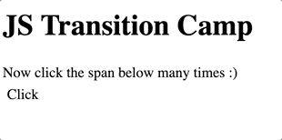

# JS Transitions Camp

Some time ago we mentioned that when we want the browser to transition a change of CSS property, we first need to let
the browser process the `transition` CSS property, and only after that set the CSS properties, which we want to
be transitioned. Here is a little project showcasing how to do it.

The effect to be achieved here is that the button, when the user clicks it, should become purple without transition,
then fade out back to transparent but _with_ a transition. The hardest part is, if we are in the middle of
transitioning back to a transparent background and the user clicks the button again, to stop the transition then
and make an abrupt change to a purple background again:

[First example](./1st-example.html), done mostly by manipulating CSS properties with JS.

[Second example](./2nd-example.html) somewhat offloads a lot to CSS ( this one I barely understand myself but
this seems to be how it works ).
