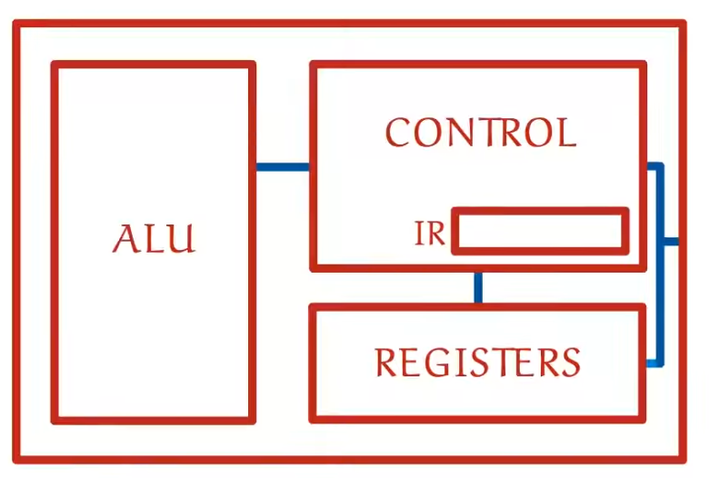

# How Compilers Work

## Intro

So you write the source code of your program like this:

```
function createSecretHolder(secret) {
  const obj = {};
  let secretProp = secret;
  obj.getSecret = () => secretProp;
  obj.setSecret = function(newSecret) {
    secretProp = newSecret;
  };
  return obj;
}
```

But the computer can't execute it: it only understands binary. Thus you need to pass your source code, which is basically
just a string of textual data, thru a compiler. Compiler is just a complicated low level cli tool that is going to take
that source code text and convert it to the 0s and 1s that the computer can understand. The compiler is going to create
a new executable file which contains all those 0s and 1s. If you try to run this executable file from the terminal
like so: `./someFile`, then the OS is going to take the 1s and 0s contained inside `someFile` and feed them right
into the computer. The computer will then generate the appropriate electronic signals, which, as a result, will make
it do whatever things you instructed it to do. Now let's look at it just a little bit closer to _really_ expand
our understanding.

## Why 1s and 0s

Let's recall our _Elements of a Computer System Studies._ At the lowest level the computer's CPU can only add
and subtract numbers ( remember how computers add numbers by turning on the right bits and passing the carry
bit and all ) as well as write to memory. In other words there are no means to tell the computer: execute an if
statement, or: create a function. So, under the hood that executable file, which the compiler creates, with 1s and 0s
in it, is just a set of instructions for the CPU to do. For instance, supposing that our executable file looks like this:

101010100101010101010101010110111010101110101010111101111111010011101010000001111010101100000110101011101010110101010000110101011010101001010101010101010101101110101011101010101111011111110100111010100000011110101011000001101010111010101101010100001101010110101010010101010101010101011011101010111010101011110111111101001110101000000111101010110000011010101110101011010101000011010101...

These bits:

10101010010**101010101**0101010110111010101110101010111101111111010011101010000001111010101100000110101011101010110101010000110101011010101001010101010101010101101110101011101010101111011111110100111010100000011110101011000001101010111010101101010100001101010110101010010101010101010101011011101010111010101011110111111101001110101000000111101010110000011010101110101011010101000011010101...

might be saying: write this stuff to memory.

These bits:

1010101001010101010101010101101110**101011101010101111011**11111010011101010000001111010101100000110101011101010110101010000110101011010101001010101010101010101101110101011101010101111011111110100111010100000011110101011000001101010111010101101010100001101010110101010010101010101010101011011101010111010101011110111111101001110101000000111101010110000011010101110101011010101000011010101...

might be saying: jump forward that many lines. While these bits, for instance:

1010101001010101010101010101101110101011101010101111011111110100111010100000011110101011000001101010111010101101010100001101010110101010010101010101010101011011101010111010101011110111111101001110101000000111101010110000011010101110101011**01010100001101010110101010010101010101010101011**011101010111010101011110111111101001110101000000111101010110000011010101110101011010101000011010101...

might be saying: execute the following bits but only if that one bit over these is 1 ( `true` ).

And so on.

Such operations together comprise the _machine code_. So the 1s and 0s that the executable file consists of is actually
the machine code.

So you might be wondering how come the computer only understands the machine code, why the 1s and 0s specifically?
The answer lies in how the computer processor works. For instance here is the circuitry that the CPU consists of:



For instance, 0 means send the negative electric charge, 1 means send the positive electric charge, which causes
certain transistors to open or close and as a result makes the computer do things. And in order to connect the right
circuitry together for the computer to, for example, write something to memory, we might need to send this kind of
charge to the CPU: `1000101010111` ( thus we need to send first a positive charge, then negative charge 3 times,
then positive again and so on, ). In other words the `1000101010111` binary command might mean: write this thing to memory.
And that is why binary. And that is _exactly_ what the executable file generated by the compiler does, that is exactly
the type of commands that the machine code inside it contains. So as you can see programming-language structures
like variables, if statements and so on don't really exist inside the computer, they are just high-level structures
to help us as humans be able to instruct the computer what to do ( because it is far too complex for us to try and write
multiline billion code bases in 1s and 0s right ).

## Source Code to Machine Code

So how does the Compiler turns for instance this program:

```
function main() {
  let x;
  x = 3;
}
```

into machine code?

First of all Compiler needs to break our source code into Tokens. At first the source code is just a string
to the computer, a bunch of meaningless Unicode characters. Thus the compiler examines the Source Code to take out
the words out of it that actually make sense, for instance, in the example above, the word `"function"` means
a function declaration, the word `"let"` means variable initialization. Thus the compiler might even use something
like RegEx to break the symbols of the source code into Tokens.

**Note:** now you understand why so many languages need semicolons: it is just so that the compiler has easier time
separating the Source Code into individual lines and ultimately converting it into tokens.

After that the compiler analyzes the tokens to build an abstract syntax tree. We have already talked about and seen
those as part of the Babel tutorial. Here is an example: let's take a look at this line in our source code: `let x`
the compiler is going to break it ( for instance by means of using RegEx or something similar ) into two tokens:
`let` and `x`. So the first token is a keyword, it means variable declaration, the 2nd token is the name of the
variable. Thus part of the Abstract Syntax Tree for this particular line is going to be:

```json
{
    "type": "VariableDeclaration",
    "start": 20,
    "end": 26,
    "declarations": [
        {
            "type": "VariableDeclarator",
            "start": 24,
            "end": 25,
            "id": {
                "type": "Identifier",
                "start": 24,
                "end": 25,
                "name": "x"
            },
            "init": null
        }
    ],
    "kind": "let"
}
```

After processing the whole string the Abstract Syntax Tree is going to look like this:

```json
[
    {
        "type": "FunctionDeclaration",
        "start": 0,
        "end": 37,
        "id": {
            "type": "Identifier",
            "start": 9,
            "end": 13,
            "name": "main"
        },
        "generator": false,
        "async": false,
        "params": [],
        "body": {
            "type": "BlockStatement",
            "start": 16,
            "end": 37,
            "body": [
                {
                "type": "VariableDeclaration",
                "start": 20,
                "end": 26,
                "declarations": [
                    {
                        "type": "VariableDeclarator",
                        "start": 24,
                        "end": 25,
                        "id": {
                            "type": "Identifier",
                            "start": 24,
                            "end": 25,
                            "name": "x"
                        },
                        "init": null
                    }
                ],
                "kind": "let"
                },
                {
                    "type": "ExpressionStatement",
                    "start": 29,
                    "end": 35,
                    "expression": {
                        "type": "AssignmentExpression",
                        "start": 29,
                        "end": 34,
                        "operator": "=",
                        "left": {
                            "type": "Identifier",
                            "start": 29,
                            "end": 30,
                            "name": "x"
                        },
                        "right": {
                            "type": "NumericLiteral",
                            "start": 33,
                            "end": 34,
                            "value": 3
                        }
                    }
                }
            ]
        }
    }
]
```

Then the compiler would need to look at the AST and figure out the machine code that does the same things as written in
the AST. For instance by looking at the AST above, we know that we need the machine code which would declare a variable
and assign the value `3` to it. Such machine code might look something like this:

```
10010101010101
01010100101011
00101010101010
10101010101101
```

It is a little hard to read, so let's write it in assembly language:

```
pushq %rbp
movq %rsp, %rbp
movl $3, -4(%rbp)
movl $0, %eax
popq %rbp
ret
```

thou very cryptic-looking, the assembly language corresponds almost one to one to the simplest binary commands. It means
that we can compile the assembly language to binary without having to build AST or tokenizing or anything. For instance,
`movl` might correspond to the `0101011101001` binary command that does the same thing. In fact there was a time when
people programmed in assembly language only!

But what does the program above written in assembly language actually do? Well, we are only interested in this line:

```
...
movl $3, -4(%rbp)
...
```

Looks like it is moving the value `$3` ( or just `3` ) to this: `-4(%rbp)` memory location. The rest of the stuff is
responsible for starting and ending the program we are running.

See, it is doing the same thing as our source code above :)

What if we change our source code to do something like this:

```
let x = 3;
x = x + 2;
```

The compiler is going to go thru the same process of tokenizing, building AST and doing other stuff and finaly
will generate the machine code, which corresponds to this assembly code:

```
pushq %rbp
movq %rsp, %rbp
movl $3, -4(%rbp)
addl $2, -4(%rbp)
movl $0, %eax
popq %rbp
ret
```

This time the assembly code is the same as last time except this one line:

```
...
addl $2, -4(%rbp)
...
```

`addl` means take the value of `$2` and add it to whatever value is stored in this: `-4(%rbp)` memory location, which
is the value of `x`, thus we get `x + 2`, amazing!

## Assembly Language

So here are the operations in the source code vs their equivalents in assembly language:

```
x    =  ...    -->    movl ...
...  +  ...    -->    addl ...
```

You might have noticed that writing to memory ( assignment `=` ) as well as mathematical operations ( addition `+` )
are supported natively by the CPU. What I mean by that is something like an addition is a _binary operation_ itself,
it is just a matter of turning some bits on and turning some bits off ( remember the video on how computers add values
and the example with the lamps? ). But what about the if statements and while loops? It is not a binary operation,
how should the CPU handle it if it knows only how to do math stuff, write to memory and probably do some other
simple things?

Well, there are no _machine instructions_ ( means instructions like addition that the CPU can do by just flipping
bits on and off ) that are equivalents to functions, if statements, while loops and so on. In order for us as
programmers to be able to use all those functions, if statements and while loops, the compiler simply simulates
their behavior with the machine instructions that do exist.

Let's look at some examples of that. Imagine we have the if statement like this:

```
let x;
x = 3;
if (x < 10) {
    x = x + 1;
}
```

The resulting assembly code is going to look like this ( the `# (*)` stuff is just my way of writing comments
in assembly thou they probably don't exist there ):

```
         pushq %rbp
         movq %rsp, %rbp
         movl $3, -4(%rbp)
         cmpl $9, -4(%rbp)      # (*)
         jg   ENDIF             # (**)
         addl $1, -4(%rbp)      # (***)
ENDIF:   movl $0, %eax          # (****)
         popq %rbp
         ret
```

The code inside the if statement `x = x + 1` is written as usual in line `# (***)` in the assembly language.
The code in line `# (*)` checks if the value in the memory cell `-4(%rbp)` is less than or equal to `9`,
the command in the next line `# (**)` checks whether the command above it ( `cmpl $9, -4(%rbp)` ) returned `false`
and if so, jumps to the line labeled `ENDIF`. Notice how, if the expression in line `# (*)` were to evaluate
to `true`, the code in line `# (**)` wouldn't jump to the line labeled `ENDIF`, conveniently executing all the
code before it on the way, which means executing the body of the if statement ( contained in line `# (***)` ),
thus stepping inside the if statement if the condition is `true`. See how, with simple machine commands, we emulated
the behavior of the high level programming structure, the if statement.

That is how we would implement the if else statement in the assembly language:

Source Code:

```
if (x < 10) {
    x = x + 1;
} else {
    x = 44;
}
```

Assembly language:

```
         pushq %rbp
         movq %rsp, %rbp
         cmpl $9, -4(%rbp)
         jg   ELSE            # (*)
         addl $1, -4(%rbp)    # the body of the if statement
         jmp  ENDIF
ELSE:    movl $42, -4(%rbp)   # the body of the else statement
ENDIF:   movl $0, %eax
         popq %rbp
         ret
```

So now in line `# (*)`, if the expression above evaluates to `false`, we jump to the line labeled `ELSE`, if, however,
the expression evaluates to `true`, then we don't jump, go execute the body of the if statement as in the previous
example, but at the end of the body of the if statement we jump right to the line labeled `ENDIF` thus skipping
over the else statement.

Here is the while loop and the assembly code emulating it:

Source Code:

```
let x = 3;
while (x < 10) {
    x += 1;
}
```

Assembly language:

```
         pushq %rbp
         movq  %rsp, %rbp
         movl  $3, -4(%rbp)
         jmp   WHILE
DO:      addl  $1, -4(%rbp)
WHILE:   cmpl  $9, -4(%rbp)
         jle  DO              # (*)
         movl $0, %eax
         popq %rbp
         ret
```

The `jle` command in line `# (*)` jumps to the line labeled `DO` if the expression above it evaluates to `true`.

And so on, even functions are likewise labeled blocks of code in assembly.

## How was Compiler Developed

But remember that the compiler is a program itself. But if people use compilers to develop programs, how was the
compiler developed? Well, imagine that there is a compiler to compile C version 2 to binary. This compiler is a program
written in C, let's call this compiler, compiler `a`. Since compiler `a` compiles C version 2, compiler `a` would be
a C program compiled from C version 1. Thus in order to compile the compiler `a` we would need a compiler that would be
capable of compiling a program written in C version 1 ( because our compiler `a` is a program compiled from the 1st
version of C ). And there is such a compiler, let's call it compiler `b`. Compiler `b` is the first ever C compiler.
But it was also compiled once, and since, being the first ever C compiler, it could not have been compiled from any
C Source Code File, it leads to the conclusion that compiler `b` was compiled from a different language than C, an even
more low level language, maybe even directly from assembly language! But from what was the compiler for the assembly
language compiled? From a previous version of the assembly language!

Thus compiling the compiler with a previous version of itself, if you follow this chain to the end, then, at some point,
we reach the origins of development tools, programs written directly in machine code that help you write other programs,
literally automating the process of creating automation!

## Different Platforms

Unfortunately, if you take the executable file created by the compiler ( the one that consists of the machine code ),
and try to run it on a different computer, it might not work. You see, different computers might have different
Operating Systems as well as different Processors and so on. And different Processors for instance use different
machine instructions. What this means is a different processor would need different 1s and 0s to write something
to a memory. Thus if you want your program to run on a different platform you need to compile it specifically for
that platform. And since there are just so many of them ( Windows based, Android devices, 32 bit OS, 64 bit OS etc. ),
it is actually quite a task.

There are several ways people have come up with to solve this issue, though sometimes you would simply need to
just have to compile the program for many many different platforms.

## Compiled vs Interpreted Languages

There is such a thing called an Interpreter. Basically an Interpreter is a program that is given Source Code
( actually it can also be given Byte Code and technically anything that isn't machine code, we will look
into what Byte Code is in a second ). Then the interpreter is told to execute 5 lines, for instance, of that
Source Code to make the computer do whatever the Source Code says. What the Interpreter does is it takes the 1st line,
compiles it to Machine Code, makes the computer execute that machine code, then goes to the 2nd line, takes the 2nd line,
compiles it to Machine Code, makes the computer execute that machine code and so on executing the Source Code
_line by line._

Now imagine you write a program in C that compiles to the machine code that should run on Windows. If you want that
same program to also run on Linux ( to compile it to the machine code that is understood by the Linux OS ), then you
actually need to modify a big part of the _Source Code_ of your C program, just for it to run on a different OS
( not to mention it is actually not that easy having to always create so many different compiled binaries for each
individual platform )! That is not OK as you would need a different Source Code for each platform you need to support:

```
Source Code 1      Source Code 2     ...      Source Code n
    |                   |                          |
    |                   |                          |
    |                   |            ...           |
    v                   v                          v

Machine Code 1    Machine Code 2     ...      Machine Code n

    |                   |                          |
    |                   |                          |
    |                   |            ...           |
    v                   v                          v

  Windows            Linux           ...    Some Other Platform
```

Interpreted Languages solve this issue. In order to run the Source Code of an _interpreted language_ on your machine,
you first need to install the Interpreter for that language, which would go line by line first converting the
Source Code to machine code, then running it, then going to the next line. After that you send the Source Code to
the consumer of your program ( the user's OS I mean ) and then the user has to use the Interpreter to run your program.
This solves the cross platform issue as now you have the same Source Code for _every_ platform, thou it does come
at the cost of performance as you need to first convert the source code to machine code and only then run it,
with compiled languages there isn't such a problem as the 1s and 0s of the compiled version of your program go straight
into the CPU.

## Byte Code

Languages like Java came up with Byte Code. Byte Code is what Java compiles to, but Byte Code isn't machine code,
instead you could think of it as super compilation optimized Source Code. Thus this cross platform issue with Java
is solved easier because you compile your *.java source code and then distribute it as the Byte Code. Then the
consumer of your Java Byte Code program needs to install the Java Byte Code _interpreter_, which, when your app is
given commands, would go thru the Byte Code line by line, converting each line first to the machine code, then
executing it on the fly.

It is a little bit better as converting each line of Byte Code to machine code is faster than converting each line
of Source Code because Byte Code is more compilation optimized than Source Code, almost like the Assembly Language.

And it also means that you have the same Source Code for every platform! The only inconvenience is you would
need a Java Interpreter installed on each of those Platforms.
