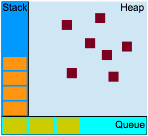

# Part 1 Headings
#### Heading 4
##### Heading 5
###### Heading 6

# Part 2 bold & italic

**Bold**

__Bold__

*Italic*

_Italic_

~~Strikethrough~~

*__Lorem Ipsum__*

**_Lorem Ipsum_**

**_~~Lorem Ipsum~~_**

**This ~~text~~ is _extremely_ important**

# Part 3 Quoting text

In the words of Abraham Lincoln:
> Pardon __my French__

# Part 4 Quoting code:
Use `git status` to list all new or modified files that haven't yet been committed.

Some basic Git commands are:
```
$ git status
$ git add
$ git commit
```

# Part 5 linking

This site was built using [GitHub Pages](https://pages.github.com/).

Go to [__Part 3 Quoting Text__](./markdownCheatSheet.md#part-3-quoting-text).

Use case sensitive text to create a [link][text or Number here] (the link itself is way way way below)

Go to the very first created file here: [_CodeWarsOne_].

[text or Number here]: https://example.com/
[_CodeWarsOne_]: ../toolshed/Laboratory.js

# Part 6 list
#### Unordered List:
- George Washington
- John Adams
  - One
  - Two
  - Tom
    * Coffee
      - Sugar
      - Milk
      - Love
    * Orange Juice
    * Tea
    * Cocoa
- Thomas Jefferson

#### Ordered List:
1. Tom
    - Cool
    - Awesome
2. Elijah
    * Interesting
      * OK
        - Bookworm
3. Smith

# Part 7 Task List
- [ ] Buy Milk
- [x] Buy Soda
- [ ] Buy Coffee
- [x] Buy Mars

# Part 8

---
***

As there as no PR's or issues right now the #2 reference is futile. We will have to wait till @TomSssM :koala: does smth about it.

___



<p align="center">
  
</p>

# Part 9
| Hey You, I Love Your Soul | Invincible | Collide |
| :--- | :---: | ---: |
| Locked In a Cage | You Take My Rights Away | Savior |
| Things are Coming Down, Of things Coming Down | Best Kept Secret | Open Wounds |

# Part 10 Fenced code blocks
```javascript
const extends = function(Child, Parent) {
  Child.prototype = Object.create(Parent.prototype);
  Child.prototype.constructor = Child;
  Child.prototype.superclass = Parent.prototype;
}
```
# Part 11 Line Breaks

You can either do `space` + `\` to create a new line or simply put 3 `space`s where `\n` is supposed to be. __Do note__ however that this way you create a new line and not separate text into paragraphs. In order to separate two chunks of text into two paragraphs put an empty line between them:

Here is a \
new line 1

Here is a
new line 2

Here is a

new paragraph
