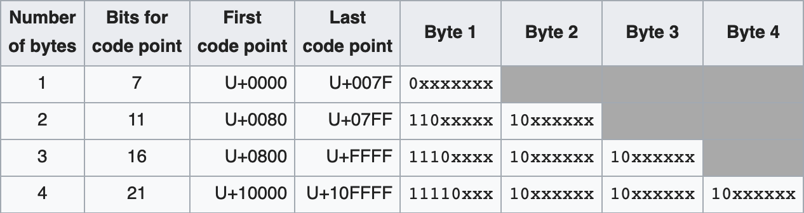
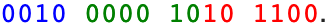
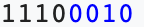
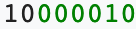
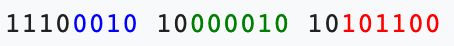

# Unicode vs `ASCII` vs `UTF-8` and so on

> the `†` character means there is some extra data about this part of the article in the [Notes](./str-encoding-n-charsets.md#notes) section

## From w3schools

**The Difference Between Unicode and `UTF-8`**

`Unicode` is a Character Set. `UTF-8` is an Encoding.

`Unicode` is a list of characters with unique decimal numbers ( `Code Point`s ). A = 65, B = 66, C = 67, ...

This list of decimal numbers represents the string `"hello"`: `104 101 108 108 111`

Encoding is how these numbers are translated into binary numbers to be stored in a computer:

`UTF-8` Encoding will store `"hello"` like this ( binary ): `01101000 01100101 01101100 01101100  01101111`

Character Sets translates characters to numbers. Encoding translates numbers into binary.

## Continued

So `Unicode` is a Character Set, it is an abstract model for how to represent letters through numbers ( because in 
binary in computer we can only have numbers ). `Unicode` simply says that number 65, for instance, corresponds to 
letter `"a"`, or number 70 to letter `"p"` and so on ( sort of like a Map where keys are numbers and the values are 
letters that the numbers correspond to ). These magic numbers ( like 65 above and so on ) are also sometimes 
called `Code Points`.

In `Unicode`, `Code Points` are written as `U+<number>` where `<number>` is, naturally, that same magic number to be 
mapped to a letter ( like 65 was in the example above ).

`ASCII` is also a Character Set. It tells what letters and symbols the numbers between 0-127 should be mapped to. 
The `Code Point`s in `ASCII` look just like numbers. For instance the `Code Point` in `ASCII` for the letter `"a"` is 
`65` while in `Unicode` it is `U+65`. But unlike `Unicode`, `ASCII` is both a Character Set and a Character Encoding 
at the same time. A Character Encoding is something that knows how to take a raw binary data like `100101010` and 
convert it to `Code Point`s ( like `U+65 U+32 ...` ). The Character Encoding is a way to interpret the bits so that 
they can be converted to the proper `Code Point`s and then be represented as the right characters on the screen. 
In this matter `ASCII` is also pretty simple: it stores every `Code Point` as 1 byte ( 8 bits ). For instance if the 
raw binary data is `0100000101110100`, then as per `ASCII` take every 8 bits: `01000001 01110100`, convert them to 
decimal number: `65 116` and then map those to letters: `At`. Simple as that. Since in one byte we can store numbers 
0-255, such a convention is perfect as `ASCII` only needs numbers 0-127.

So what is different between `ASCII` ( as a Character Set ) and `Unicode` besides the form in which you write 
`Code Point`s ( `U+` vs plain number )? The whole Point of `Unicode` is that it includes all the number-to-letter 
mappings as `ASCII` does, _and more_ ( for which reason `Unicode` is also sometimes called a superset of `ASCII` ).
You see with `ASCII` you can encode any English letter plus a whole bunch of symbols as numbers between 0-127
( in the default `ASCII` there are no number-to-letter mappings for the numbers 128-255 ). But what is the `Code Point`
in `ASCII` for, say, a Japanese letter? That is the problem with `ASCII`, there isn't. And there couldn't be actually.
Japanese alphabet consists of thousands of characters while with `ASCII` you can encode the maximum of 255 characters 
( 127 of which are already occupied by mappings for English letters ). That is why `Unicode` was invented.
`Unicode` has mappings for all the imaginable characters in the world!

In `Unicode` you are not limited to 127 `Code Point`s that map to letters. In fact `Unicode` has thousands of 
`Code Point`s with which you can even encode an emoji. For instance the `Code Point` for :coffee: is `U+9749`. 
Thus number `9749` corresponds to :coffee:. See the problem here? Number `9749` in binary is `0010011000010101`.
You need 2 bytes ( not 1 as used to be ) to store the `Code Point` `9749`! That is where the problems arose as people 
started arguing how to best store the raw binary data to represent a Unicode `Code Point`. Some `Code Point`s actually 
need an astonishing 6 bytes ( !! ) to store them.

That is why `Unicode` is not, like `ASCII`, both a Character Set ( number-to-character mappings ) and at the same 
time an Encoding ( a way to store `Code Point`s in binary and to convert raw binary data into 
the correct `Code Point`s ). `Unicode` is only a Character Set because there are many different ways to encode 
`Code Point`s for `Unicode` ( because as we discussed many of the Unicode `Code Point`s need more than 2 bytes 
to store them ). In other words while `Unicode` is the default, standard Character Set, there are many Encodings that 
exist for it. While the Encoding of characters for `ASCII` simply was to store `Code Point`s as bytes ( 8 bits back 
to back that would map to an array of `Code Point`s ) there are many Encodings for `Unicode`, each of which would 
produce a different pattern of bits ( thus `0010011000010101` in one Encoding may produce `U+9749` but in a different 
Encoding it may produce `U+1233` or even some garbage value - ever saw those question marks `?` or boxes instead of 
letters :smile: ).
 
There are many Encodings for `Unicode`: `UTF-8`, `UTF-16` and so on.

In `UTF-8` we store `Code Point`s between `U+0` and `U+255` as one byte ( because one byte is enough to fit them, also 
it makes `UTF-8` completely compatible with `ASCII` ), after that we store `Code Point`s, which need 2 bytes to 
encode them, as 2 bytes, that need 3 bytes as 3 bytes and so on ( that need `n` bytes as `n` bytes ), very efficient.

In `UTF-16` we store `Code Point`s starting at 2 bytes, so `U+255` would be stored as `0000000011111111`.

## In Real Life

The Knowledge of Character Sets ( `Unicode` particularly ) can help us when we need to insert the character that is
missing from the keyboard to HTML.

For instance here is how we would insert a copyright symbol:

```html
<span>Copyright &#174;</span>
```

This `&...;` thing is called an _HTML Entity_. There are actually many ways we could use this one. For every entity
there is a corresponding Unicode `Code Point`: for instance for the copyright symbol, the Unicode `Code Point` is
`U+174`, or as a hexadecimal number it is `U+00ae`. In HTML we can use the Unicode `Code Point`s to represent 
characters that are not present on the keyboard ( because there is every possible character in the world available
in `Unicode` ). In order for HTML to show the character from the Unicode `Code Point`, we need to put the value of the
necessary `Code Point` between `&...;` prefixed by `#` ( like we did above ). 

Also HTML allows to insert special characters not only via Unicode `Code Point`s but also via their names. That is 
right, each such entity ( like the copyright symbol above though it could even be something as simple as the letter 
`"a"` ) has a name associated with it. For the copyright symbol the name is `reg`. Do note though that such entity
names like `reg` above are associated with HTML entities only, **the Entity Names have nothing to do with 
`Unicode`, it is just an alias which we can only use in HTML.**

If we use an entity name inside HTML we need to put it between `&...;` ( without the `#` ).

Finally if we want to use the Unicode `Code Point` _in hexadecimal_ we need to additionally prefix it by `x` so
that the Entity looks like `&#xae;` ( `ae` is 174 in decimal ).

Here is the cheatsheet:

- `&<entity-name>;`
- `&#<entity-number>;`
- `&#x<entity-hex-number>;`

Thus each `p` below will correctly render the copyright symbol:

```html
<p>I will display &reg;</p> <!-- Entity's Name - thus # is not needed -->
<p>I will display &#174;</p> <!-- Entity's Code Point - thud # IS needed -->
<p>I will display &#xAE;</p> <!-- Now Entity's Code Point is in hexadecimal - thus we need to prefix
                                  the hexadecimal number "AE" by "x" --> 
```

## How `UTF-8` and Percent Encoding Works

Sometimes we need to encode a certain character when it is sent as part of the URL ( in GET requests for instance ).
For example if we send cyrillic letters or reserved characters ( reserved character is a character which, if used as
part of the URL, has a special meaning, for instance the character `/` is _reserved_ as it is used as part of the 
`path` part of the URL to separate directories ).

Let's see, first, how to encode in `UTF-8`. If we take a look at the raw binary data encoded via `UTF-8` it is going to
have a certain structure. The first couple of bits in every byte thus encoded will have certain meaning. For instance
some `Code Point`s need 2 and more bytes to encode them. It means that some bytes are going to be intermediate bytes
comprising a `Code Point`.

For instance if a `Code Point` is stored in just one byte ( like number `71` ), then the first bit is going to be `0`:

```
0xxxxxxx
```

where `x` are the bits that are going to be used for the mantissa of the number ( of the `Code Point` ).

If there are going to be 2 bytes used to store the `Code Point` then the first byte is going to be:

```
110xxxxx
```

and the 2nd byte is going to be:

```
10xxxxxx
```

The `110` part of the 1st byte tells that there are going to be 2 bytes used to represent a `Code Point`. The `10` part
of the 2nd byte tells: _hey, I am a continuation byte_.

Likewise if we use 3 bytes to represent a `Code Point`, then the 1st byte is going to start:

```
1110xxxx 10xxxxxx 10xxxxxx
```

If we use 4 bytes to represent a `Code Point`, then the 1st byte is going to be:

```
11110xxx 10xxxxxx 10xxxxxx 10xxxxxx
```

and so on.

Here is a table to sum things up:



**Example**

So imagine we need to encode the character `"€"`. Its `Code Point` is `U+20AC`. `20AC` in binary is:



Because the final output would be stored in 3 bytes, we need to prefix the 1st byte by `1110`.
Since the first 4 bits of the 1st byte are already occupied by `1110`, we can only take out the 1st four bits 
_out of the number itself_ ( `0010` ) to put into the 1st byte and thus the first byte of _the result_ is going 
to look like:



Since we need to prefix the 2nd byte of _the result_ by `10` to indicate that it is a continuation
byte, we have only 6 bits of the 2nd byte ( of _the result_ ) available to put stuff in:

```
1 0 x x x x x x
```

Thus we take out the next 6 bits out of _the number_ ( the green ones in the picture above ) and put 
them instead of those `x`s. The 2nd byte of the result is going to look like:



Likewise for the 3rd byte. The full result of encoding the Unicode `Code Point` `U+20AC` is going
to look like ( 3 bytes ):



That is how `UTF-8` works :smile:

Do note that every byte of the result ( `11100010`, `10000010` and `10101100` ) can be represented
as a hexadecimal number. For instance if we convert `11100010` ( 1st byte ) from binary to hexadecimal 
we get `E2`. Thus if we convert every byte to hexadecimal we get the following sequence of numbers:

```
E2 82 AC
```

That is exactly how weird Unicode characters are also encoded ( percent encoded ) when we send them
as part of the url. We can clearly see that especially if we send a character the encoding of which
requires more than 1 byte ( like `"€"` ). For instance the result of encoding `"€"` as a URI 
component is going to be:

```js
encodeURIComponent('€');
// "%E2%82%AC"
```

Which corresponds perfectly to the sequence of hexadecimal numbers we just distilled as the result of
encoding the `Code Point` `U+20AC` via `UTF-8`.

And that is why you see several hexadecimal numbers when encoding, for instance, 1 cyrillic character.

**Note:** This isn't meant to be a complete overview of `UTF-8` but merely a nice example of how Encodings work and
how they differ from Character Sets.

## Unicode Planes

There are very many code points in Unicode. Since there are so many of them, it was decided to separate
all the code points into groups of 2^16 code points called _planes_.
There are 17 planes overall consisting of 17 * 2^16 = 1114112 code points
( meaning the biggest code point we _could_, in theory, represent is 1114112 - 1 or 0x10ffff in hexadecimal ),
more than enough to represent all the characters on earth.

Why not more you would ask? Recall how `UTF-8` works. In `UTF-8`, the spec says that we shouldn't use more than 4 bytes
to encode a code point. But in theory we can. Let's see how many code points we can represent if we add
just a couple of bytes. What if there were 6 bytes, thus the first byte is going to be `1111110x` leaving 31 bits
( number of `x`s ) for the code point:

```
1111110x 10xxxxxx 10xxxxxx 10xxxxxx 10xxxxxx 10xxxxxx
```

Thus with 31 bits the biggest code point we can represent is 2^31 - 1, which is 2^31 characters&#x2020;
and 32 768 planes&#x2020;. The reason we have only 17 planes instead of 32 768 is because of `UTF-16`
Unicode encoding ( we will see how it works in a moment ). The biggest code point `UTF-16` can encode
is around 0x10ffff ( in hexadecimal ) and even that not without a trick, which limits us to only 17 planes.&#x2020;

In Unicode the 1st plane has most of the characters that we normally use ( and more ), while most other planes still
are not assigned any characters at all. In fact the 1st Unicode plane is so popular that it has a name BMP.
Here is what the BMP plane looks like:


The other planes are called supplementary planes. The 2nd Unicode plane called Supplementary Multilingual Plane
has emoji characters for instance.

---

## How `UTF-16` Works

Utf 16 uses 2 bytes to encode each code point. Remember, utf 8 would use a different amount of bytes depending on how big a code point was ( for this it is sometimes called a varied length encoding ). But utf 16 always uses 2 bytes whether a code point is 0x1 or 0x20ff. For this reason, all the code points of BMP ( the 0x0001 - 0xffff code points ) correspond to their binary representation because we need from 1 to 2 bytes max. to store them in computer memory. But what about code points of the 2nd or the 3rd plane? They need 3 and more bytes to store them. But in utf 16 we can use only 2 bytes ( 16 bits ) to store a single code point. Thus in utf 16 we can work only with the BMP code points. So how does utf 16 handle non BMP code points from 3 - 17 planes ( todo: check that we can encode plane 17 with utf 16 ) you ask? The answer is it uses surrogate pairs.

There is a very good explanation of surrogates in the Modern JavaScript tutorial. Make sure to read it before you continue!

Surrogate pairs are pairs of 2 usual Code Points in the BMP ( 0xsmth - 0xsmth ). These code points 0xsmth are reserved in Unicode to be surrogate characters for the utf 16 encoding and will not be re-assigned in the future. They do not produce any visual character and are used only by utf 16 encoding as surrogate characters in surrogate pairs. Toso: oops surrogate example Here is what the surrogate pair looks like: todo: here; For the parser it is easy to identify a surrogate pair: if it encounters a code point between 0xsmth - 0xsmth it knows that it is a surrogate pair. The code points in the range smth are called high surrogates and the code points in the range smth are called low surrogates: here.

Let's see how surrogate pairs help utf 16 encode code points that require over 2 bytes to be stored ( 0x10000 - 0x1ffff TODO: is it 0x1ffff cause we subtract 1000 ? ). Let's encode the code point ... todo example here ...

Do note that any Unicode code point in the range between hh - hh can be encoded using surrogates. Here are more examples: the smile example.

The same way we decode a pair of surrogates into a code point. In fact because JavaScript uses utf 16 internally that is exactly what codePointAt and TextDecoder do. You can make sure of that by looking at their polyfills. More about codePointAt vs charCodeAt can be found in the tutorial.

## Composite Characters and Emoji

Don't confuse composite chars with surrogates. These are the chars to represent which we need to group 2 code points together. For instance from the tutorial example here is the character s with dots: hh
To represent it though we need to group the letter s with the special code point hh. Hh means dots below, it is invisible on its own but if preceded by a letter, it adds dots below it: hh.

In fact it is a very common practice in Unicode to group two or more code points to get a character  ( which is different from grouping surrogates make sure not to confuse the two ). It is particularly common with emoji. For example, so far we have seen the hh emoji. To depict it we would use a code point from the 2nd Unicode plane. But sometimes emoji are created by taking an already exisitimg character like hh ( code point: 0xsmth ) and adding a special "smth" code point after it: hh, that is how we get a th emoji.

Some emoji are groups of other emoji with the zwj code point between them: hh. Here is what code points you need to write to get a dunno emoji. Also here are code points to change skin color that can be paired with other emoji code points.

---

### Notes

&#x2020; You might be wondering, if we can represent 2^31 characters, why is the biggest code point that
can be represented is 2^31 - 1? The answer is there is also 0. Thus if we can represent a total of 4 characters
starting at 0, then the biggest character we can represent is 3 ( `0`, `1`, `2`, `3` = a total of 4 characters ).
This might be particularly confusing when we talk binary. What is the biggest number that can be represented with
4 bytes or 32 bits in decimal? The answer is 2^32 - 1 ( 32 `1`s ). 2^32 is already 33 bits. Thus it is sometimes a lot
easier to use hexadecimal to answer the question above. The biggest number that can be represented with 2 bytes is
`0xffff`. We will get to it soon.

&#x2020; In order to get the number of planes, we need to divide the overall amount of characters
( 4 294 967 296 or 2^32 ) by the amount of characters each plane can hold ( 2^16 ), which is: 2^32 / 2^16 = 32 768.

&#x2020; Also let's briefly take a look at how much more convenient it is to work with code points if we write
them in hex. We know that the biggest number that can be represented using 1 byte is 255, which is 2^8 - 1.
The same number can be written in hex as 0xff. Now what if we were asked what is the biggest number that can be
represented using 2 bytes? We would say, because of what we already learnt about hex - 0xffff ( two 'f' chars
for each byte ). And vice versa. How many bytes are needed to represent this hexadecimal number: 0x1234?
Since, as we said, every 2 chars in hex correspond to 1 byte and there are 4 chars we can instantly tell:
4 / 2 = 2 bytes. See? Convenient :)

It is even more convenient to use hex for Unicode code points since we can always see in which plane the code point is.
Let's see an example of that. The 1st plane is code points 0 - 2^17 or, in hexadecimal, 0x0 - 0xffff. What about
the 2nd plane? Each Unicode plane has 2^17 chars in it so that the next plane is going to be code points
2^17 - 2^34 or, in hexadecimal, 0x10000 - 0x1ffff. The 3rd plane is code points 131072 - 196607 in decimal
or 0x20000 - 0x2ffff. See the tendency? The first character of the hexadecimal code point corresponds to the plane
that the code point comes from ( except for 1st plane code points ). Awesome!

## TODO

- verify and write that reserved chars are used for fonts
- verify that we can use surrogates in utf-8 / utf-16 HTML document
- read the 2 remaining articles
- what are private code points used in Unicode
- what is endianness
- numbers stuff
    - add 0.3333... in addition to 0.3(3)
    - add that most significant means leftmost
    - clear the numbers section
