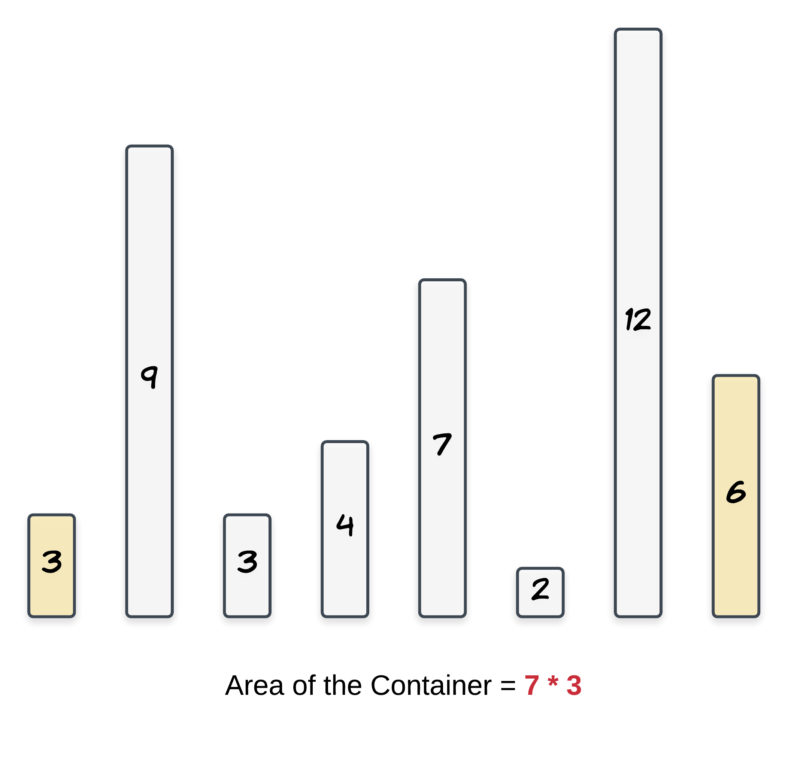
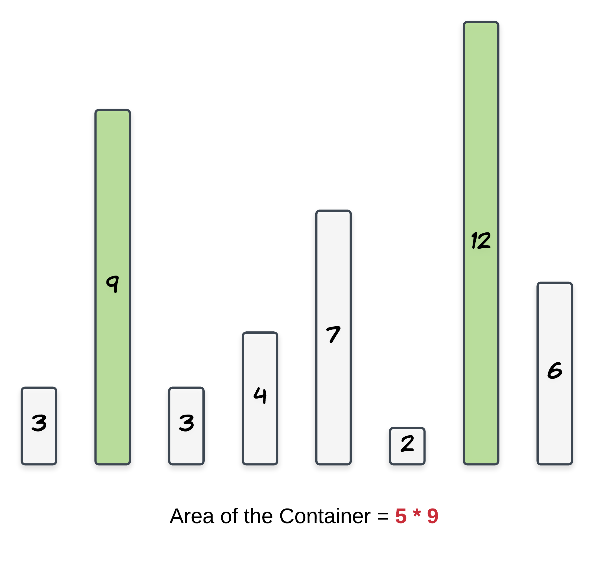

# Container With Most Water

You are given an integer array `height` of length `n`. There are `n` vertical lines drawn such that the two endpoints of the `i'th` line are `(i, 0)` and `(i, height[i])`

Find two lines that together with the x-axis form a container, such that the container contains the most water

Return _the maximum amount of water a container can store_

__Notice__ that you may not slant the container

__Example 1:__


__Input:__ `height = [1,8,6,2,5,4,8,3,7]`

__Output:__ `49`

__Explanation:__ The above vertical lines are represented by array `[1,8,6,2,5,4,8,3,7]`. In this case, the max area of water (blue section) the container can contain is `49`

__Example 2:__

```
Input: height = [1,1]
Output: 1
```

<details>

<summary>Hint 1</summary>

The aim is to maximize the area formed between the vertical lines. The area of any container is calculated using the shorter line as length and the distance between the lines as the width of the rectangle

`Area = length of shorter vertical line * distance between lines`

We can definitely get the maximum width container as the outermost lines have the maximum distance between them. However, this container __might not be the maximum in size__ as one of the vertical lines of
this container could be really short

Contemplate this example:
```
[3, 9, 3, 4, 7, 2, 12, 6]
```


<br />


</details>

<details>

<summary>Hint 2</summary>

Start with the maximum width container and go to a shorter width container if there is a vertical line longer than the current containers shorter line. This way we are compromising on the width but we are looking forward to a longer length container

</details>

---

| [:arrow_left: back](../README.md) | [:white_check_mark: solution](./solution.js) |
| :---: | :---: |
